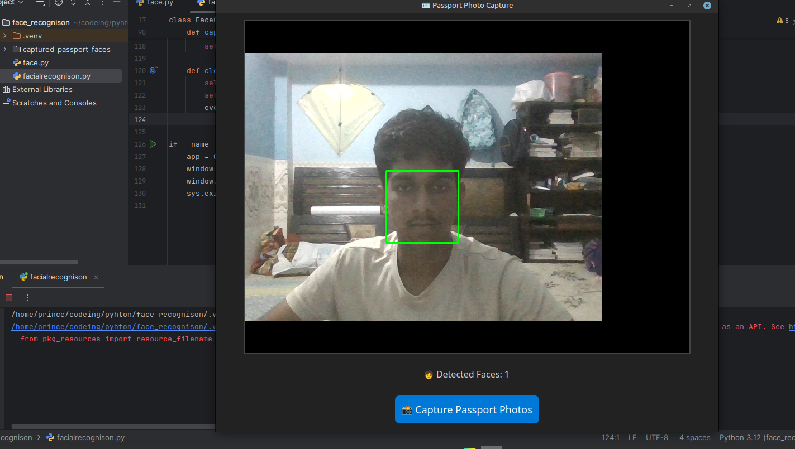
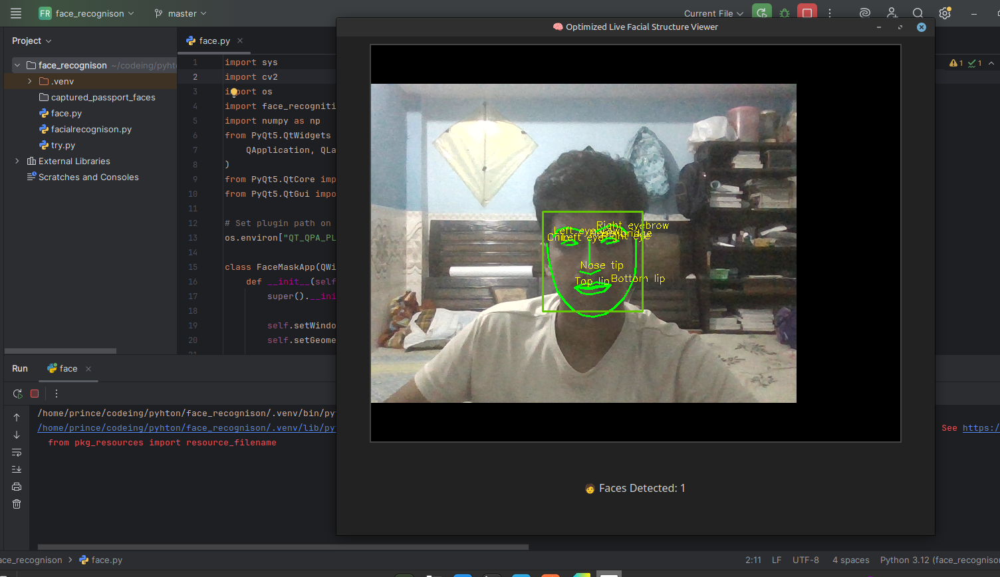
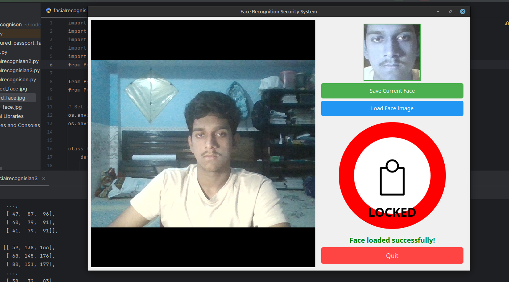

# Facial Recognition Passport & Security Apps

This workspace includes three PyQt5-based facial recognition applications built using OpenCV and the `face_recognition` library. Each app serves a specific real-world purpose:

1. **Passport Photo App** – Instantly capture passport-size face images.
2. **Facial Structure Viewer** – Visualize your facial features in real-time.
3. **Security Access System** – Unlock access using your face via webcam.

---

## 📸 Screenshots

### 1. Passport Photo Capture

Use case: For quickly clicking passport-size photos in places like exam centers or ID creation booths.



---

### 2. Facial Structure Viewer

Use case: View and study facial landmark detection on your own face.



---

### 3. Face Unlock System

Use case: Simulates a facial recognition-based lock system for access control.



---

## 🔧 Features

* 🎥 **Live Camera Feed:** Real-time face detection and tracking.
* 🛂 **Passport Photo Capture:** Crops and saves high-quality face images in passport format.
* 🔍 **Facial Landmark Viewer:** Shows face structure with eyes, nose, jaw, and lips mapped.
* 🔐 **Facial Lock System:** Lock/unlock access using saved face authentication.

---

## 📂 File Overview

| File                       | Description                                                                                                                                                      |
| -------------------------- | ---------------------------------------------------------------------------------------------------------------------------------------------------------------- |
| `facialrecognison.py`      | 📸 **Passport Photo App** – Automatically captures and saves detected faces to `captured_passport_faces/`. Ideal for exam or ID registration centers.            |
| `facialrecognisan2.py`     | 👤 **Facial Structure Viewer** – Real-time facial landmark mapping (eyes, nose, mouth). Great for testing or showing how face detection works.                   |
| `facialrecognisian3.py`    | 🔐 **Security Lock App** – Save a face image, and unlock access when the same face is detected. Simulates a facial lock system with animated lock/unlock status. |
| `captured_passport_faces/` | Folder where passport-style face images are saved automatically.                                                                                                 |

---

## 📦 Requirements

* Python 3.7+
* [`opencv-python`](https://pypi.org/project/opencv-python/)
* [`face_recognition`](https://pypi.org/project/face-recognition/)
* `numpy`
* `PyQt5`

Install dependencies:

```bash
pip install opencv-python face_recognition numpy PyQt5
```

---

## 🚀 Usage

Run any of the apps via terminal:

```bash
python face_recognition1.py       # Passport photo capture
python face_recognition2.py      # Facial structure viewer
python face_recognition3.py     # Face-based unlock system
```

Make sure your webcam is connected and accessible.

---

## 📝 Notes

* On **Linux**, the Qt plugin path is set automatically in each script.
* You can customize frame capture and access control logic further as needed.
* All cropped faces are stored in the `captured_passport_faces/` folder.

---

## 👤 Author

**Prince000101**
GitHub: [@Prince000101](https://github.com/Prince000101)
